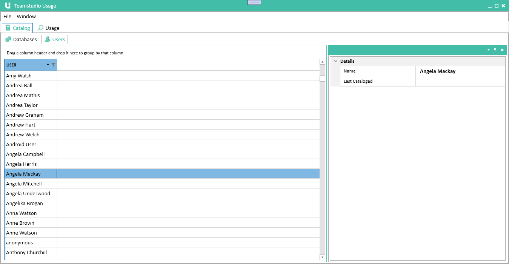
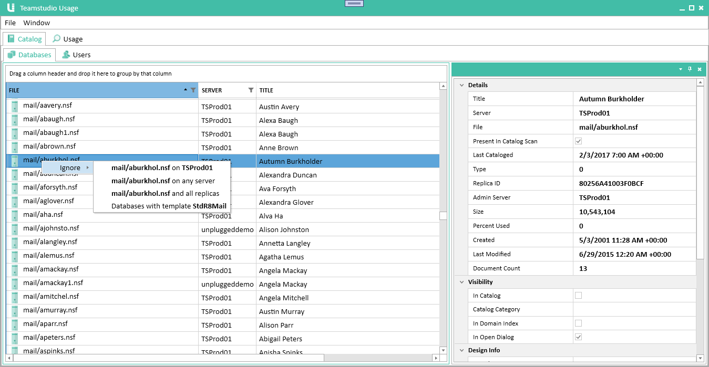

# Catalog

The Catalog module imports information from Domino server catalogs and address books. It serves as a master list of all databases, templates and users on your servers.

The catalog is updated every time you run a server scan. Once you have configured Teamstudio Usage, you can update the catalog at any time by choosing *Scan Servers* from the *File* menu. This will update both Catalog and Usage data.

!!! note
    Teamstudio Usage reads the catalog data from catalog.nsf on each scanned server, not by scanning the server's data directory. Any changes made on the server, such as adding and removing databases, will not be detected until the server has run its catalog task to update catalog.nsf. This is typically scheduled to run overnight.
    
## Viewing the Catalog
To view the catalog, select the first tab in the Usage window, titled *Catalog*.

## Viewing Databases
With the *Catalog* tab selected, select the *Databases* tab from the second tab row. This will display the catalog database view.

<figure markdown="1">

</figure>

This view is divided into two halves. On the left, a table lists all of the databases, along with key properties for each database. If you select a database, the detail pane on the right will show all of the properties for that database, including the ACL.

The table, as with all tables in Usage, is both sortable and searchable. Clicking on a column header will sort the table based on that column. Clicking again will sort in reverse order, and clicking one more time will remove the sorting. If you click on the table and press *Ctrl+F*, a search panel will be displayed that you can use to temporarily filter which databases are displayed. Note that this searching is intended for quickly locating a database in the list. If you want to limit which databases are shown in the list, see the [Filters](#filters) section below.

You can change the relative sizes of the list and details pane, and your choices will be saved. You can even close the details pane altoghter if you want to view more of the table. To re-open it, double-click on any database in the table.

Teamstudio Usage does not maintain a full history of the results of all catalog scans. However, it will never remove a database once it has been added to the catalog, since it may have associated usage data. You can quickly see whether a database was present in the most recent catalog scan by looking for the server icon next to the database path. If this icon is missing, the database was not found on the most recent server scan. You can also see on the details pane a checkbox showing whether the database was present in the last server scan, and the timestamp when the database was last found in a scan. 

The database list may also contain databases that have never been found in catalog.nsf, although this is rare. This can happen if Usage encounters an unknown database when importing usage data. There needs to be a catalog entry to own the usage data, so we create a 'stub' entry containing just the database server and path. 

## Viewing Users
With the *Catalog* tab selected, select the *Users* tab from the second tab row. This will display the catalog user view.

<figure markdown="1">

</figure>

This view works very similarly to the databases view, described above. However, there is no server icon showing whether a user was found during the most recent scan because no one server is the final authority on whether a user name exists. The same user may be defined in multiple address books on different servers, and may be present in some but not others.

### User and Server Names
Teamstudio Usage stores all user and server names internally in full canonical form (e.g., *CN=Demo Adviser/O=Teamstudio*). The UI displays only the common name (*Demo Adviser* in the previous example.) You can hover over the name to view the full name in abbreviated form (*Demo Adviser/Teamstudio*.)

## Filters
Filters allow you to hide databases and users from the UI based on a range of criteria. Teamstudio Usage will continue to collect catalog and usage data for any filtered databases and users, so you can add and remove filters at any time with no loss of data. To filter a database or user, switch the the appropriate tab in the catalog, right-click on the entry you want to hide and choose *Ignore* from the popup menu.

<figure markdown="1">

</figure>

This will give you a list of options based on the selected element. For a user, the only option is to hide that specific user. For a database, you can hide based on the database's path, template name or replica ID. See the [Filters](filters.md) page for more details on filtering.