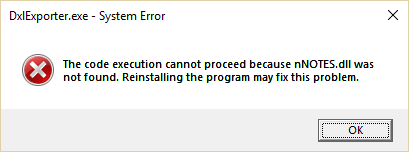

# Configuration

You must run the Configuration wizard before you can use Teamstudio Usage. You can rerun it at any time by choosing *Configuration* from the *File* menu.

## Configuration Settings

### Notes Program Folder
Teamstudio Usage uses a helper program, CatScan, to read catalog and usage information from Domino servers. Usage will add the folder specified here to the path before invoking CatScan. If you see an error like

<figure markdown="1">

</figure>

when attempting to scan your servers then this folder is not set correctly.

Teamstudio Usage will attempt to set this correctly but you may need to change it if you have multiple versions of Notes installed.

### Notes INI Location
The location of the notes.ini file is also required to run CatScan. This will usually be set correctly for you, but you can modify it if necessary.

!!! note
    You need to specify the full path to the notes.ini file here, including the file name. Do not just
    provide the folder containing the ini file.

### Notes ID File
The full path and name of the Notes ID file to use when scanning servers (e.g., *C:\Notes\Data\User.id*.)

### Password
The password for the Notes ID file above. The password is stored in an encrypted form, but it is passed to the CatScan program in plain text when you perform a scan. If you do not want to store a password, you can leave this blank and instead ensure that your Notes client is running whenever you run Usage. To allow Notes to share credentials with Usage, you must choose *File|Security|User Security...* from the menu in the Notes client, and check the box labeled *Don't prompt for a password from other Notes-based programs (reduces security)*.

### Domino Servers
The list of servers that Teamstudio Usage will scan for catalog and usage information.

* To add a new server to the list, enter the server name, and press the Add button. You can enter the server name in any form that is convenient for you: canonical, abbreviated, or just the common name. Usage will always contain the full canonical server name.
* To remove a server from the list, select the server and press the Remove button.

!!! note
    If you remove a server from this list, Usage will not include that server in future scans. However, all existing information will be retained. Teamstudio Usage never deletes any catalog or usage data.
    
To pick from a list of available servers, click the down arrow at the end of the server name field and select *&lt;Scan&gt;* from the dropdown. This will populate the dropdown with a list of known servers from the address books on your local client and home mail server. Note that the ability to scan for available servers relies on earlier Notes settings being correct so you may see an error if, for example, the Notes program folder is not set correctly.

There is no hard-coded limit on the number of servers that you can scan, but the time required to recompute usage statistics may become significant in large, busy environments. See [Performance](usage.md#performance) for more details.

### Schedule
As with other information stored in log.nsf, activity logging will be deleted after a short retention period. By default this is two weeks. In order to ensure that Usage doesn't miss any activity data, you should run usage scans regularly. Once the data is imported into Usage, it will be retained permanently. To help with this, Teamstudio Usage can use the Windows Task Scheduler to run regular scans. This option allows you to schedule a scan every day at a time of your choosing. This will work for many cases, but if you require a more complex schedule then you can edit the task directly in Windows Task Scheduler. 

!!! note
    The Task is registered in the Task Scheduler Library under the Folder *Teamstudio\Usage*. The task
    is not configured to wake your computer from sleep since this is not supported in all environments, but it is configured to catch up on missed scans. So as long as you use your computer regularly, scans will still run even if your computer is asleep at the scheduled time.
    
!!! note
    If you use a different system for running scheduled tasks on your computer, you need to configure the system to run the command *Usage.exe --scan*. With a standard installation, Usage.exe will be installed into *C:\Program Files\Teamstudio\Usage*. It is important that the same user credentials are used for scheduled scans and running the Usage UI since configuration settings and data are stored in the user's *AppData\Local\Teamstudio\Usage* folder.
