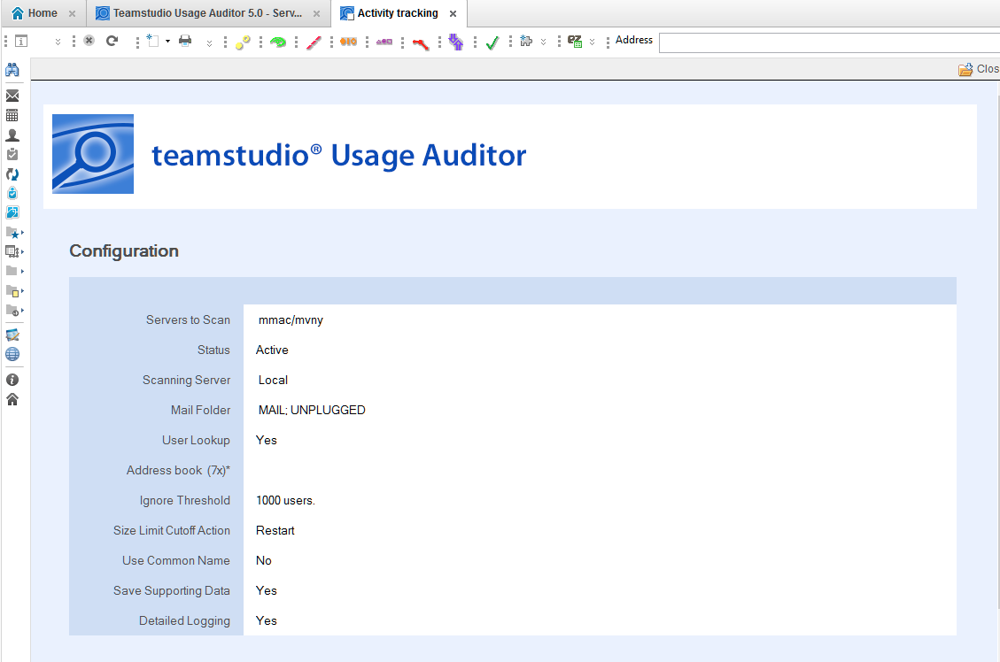

# Configuring Usage Auditor

Teamstudio Usage Auditor is configured by creating **Server Configuration** documents and specifying options to control how data is collected.

**Server Configurations** can be disabled or enabled by selecting configuration documents and clicking the **Deactivate** or **Activate** action in the view.

To create a new **Server Configuration**, navigate to the **Admin > Server Configurations** view via the left-hand navigator, and click the **Create Configuration** action.

A new **Server Configuration** document will appear. Inline help is visible when the document is in edit mode. See below for detailed descriptions of these settings.
<figure markdown="1">
  
</figure>
 
## Settings 
**Servers To Scan**: Enter or choose the name of the server(s) that should be scanned when this configuration is run. Multiple servers can be listed, one per line, if the same settings are desired for each. Alternately, separate configuration documents can be used for each server.

**Status**: Active server configurations will be scanned when the specified **Scanning Server** instance runs scans. Configurations can be marked **Inactive** to temporarily disable scanning.

**Scanning Server**: Select **Local** to run the scan on the current workstation. Because of the intensive processing involved in collecting and reporting on usage statistics, it is not currently recommended to run Usage Auditor on server.
 
**Mail Folder**: List folder(s) one per line whose content should be identified as **Mail** databases. Databases marked as **Mail** can be hidden from **Database** views to make it easier to analyze usage of other applications.
 
**User Lookup**: Choose Yes to enable Domino Directory (Address Book) lookups when user names are processed. Enabling this feature will identify the type of user as **User**, **Server**, or **Unknown**.

If this setting is set to **No**, no lookup will occur, and all user names will be marked as **Users**.

On Notes/Domino prior to version 8, the file name of the address book must also be specified. This file name is ignored on Notes/Domino 8+.

**Ignore Threshold**: This setting can be configured to limit the number of users added to the User table on Database documents. Once the limit is hit, the Database document will be automatically marked Ignore (see **Cutoff Action** below), and user-level activity will not be tracked. Ignored databases can also be hidden from views.

This setting is useful for focusing analysis on databases that fall within lower usage limits. For example, if only applications with less than 50 user will be considered for decommission or moved to another server, this setting can be used to reduce clutter from higher use databases in the views.
 
**Size Limit Cutoff Action**: Defines what action will be taken when the User table on Database documents has grown too large to store.

Usage Auditor stores user names of users who have accessed an application in the Database document, to provide a consolidated view of usage. Notes/Domino limits the amount of “summary data” (data that can be displayed in views) to approximately 64K. This limit is typically hit in the vicinity of 1000 names, although it can vary greatly depending on the average length of the names in use. In order to manage this limitation, Usage Auditor can do one of two things when this limit is approached:

* **Ignore** marks the Database document as ignored, and user-level tracking is disabled for this application going forward. This is useful when the goal is to categorize applications into usage bands, where it may be assumed anything with a large number of users will fall in a certain category.

* **Reset** removes all values from the user table and begins over. This option can be used when it is desirable to know which users most recently used the application.

Database level statistics, for example the total number of hits, continue to be tracked regardless of which setting is chosen.
 
**Use Common Name**: Specifies whether the Database documents track users by Common name (e.g. John Smith) or by the Abbreviated name (e.g. John Smith/Sales/Acme). Storing common name reduces the byte size of the name and allows more names to be stored before hitting the Size Limit Cutoff as described above. However, if users have the same user name (for example, IDs in multiple organizational units or domains), they will not be distinguishable in Database documents.
 
**Save Supporting Data**: Choosing **Yes** for this setting will cause Usage Auditor to save compressed versions of the raw usage data collected from the server’s Activity Log. Saving this data can help Teamstudio support troubleshoot, should any issues arise. 
Saving this data may also allow Teamstudio support to regenerate usage statistics for the entire period of usage tracked by Usage Auditor (vs. the default 2 week period tracked by the Domino server) if needed.
It is recommended to enable this setting unless file size of the Usage Auditor database is an issue.
 
**Detailed Logging**: Detailed logging can be enabled to provide additional information about the scanning process, for troubleshooting purposes. Additional logging increases the file size of the Usage Auditor database.