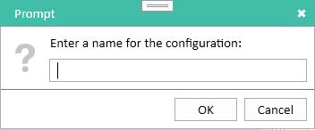

# Exporting Data

Usage allows you to export data from both the Catalog and Usage modules. Three different report formats are available.

### Databases
The *Databases* report has one row for each database in the catalog. It defaults to a basic set of catalog properties and usage data, and you can optionally add any additional properties you need.

### Users
The *Users* report has one row for each user in the catalog. As with the *Database* report, a core set of catalog and usage properties are provided by default, and you can add any additional ones you need.

### Detail
The *Detail* report is useful when you need to analyze which users are accessing which database. It contains one row for every user/database combination that has a non-zero usage count. So for a given database, you can see which users are accessing that database, and for a given user you can see which databases they have accessed. You can add additional catalog and usage properties to the report if needed.

## Filtering Data
Reports respect any existing database and user filters you have defined. So, for example, a database that has been filtered out will not appear at all in *Databases* and *Detail* reports and will not be included in any usage counts in a *Users* report.

!!! Note
    Reports include only usage data by users. Server and Agent usage is excluded.

## Creating a Report
To create a report, select *Export Data* from the *File* menu. This will display the *Export Data* dialog.

<figure markdown="1">

</figure>

### Configuring the Output Format
Usage currently only supports saving reports as a delimited text file. The file will be UTF-8 encoded.

* **Output File** The file where the output will be written. The file will be overwritten if it already exists.
* **Separator** Files can be written using either a comma or a tab as the field separator.
* **Include Header Row** Include a header containing the column names as the first row of the file.

### Configuring the Report Type
The three different report types, *Databases*, *Users* and *Detail* are described above. Switching report type will replace the currently selected list of columns with a default set of columns appropriate for the new type.

### Configuring the Date Range
Usage offers three date range selection options.

* **All Time** The report will include all usage counts for all time.
* **Last** The report will include usage data for a number of preceding time periods. Selecting this option will enable a numeric input field to select the number of periods and a selector for the period type: *Year(s)*, *Month(s)* or *Day(s)*. For example, you could choose to include data for the previous 7 days, the last 6 months or the last 1 year.
* **Custom** The report will include usage for a fixed time period. Selecting this option will enable two date input fields to enter the start and end dates of the range. You do not need to specify both, they default to the earliest and latest data available, respectively. For example, you can generate a year-to-date report by setting the *From* date to January 1 of the current year and leaving the *To* date blank. The dates that you specify are inclusive, so the previous example includes usage on January 1.

### Configuring the Columns
Each report type comes with a default set of columns. These consist of the database server and pathname for database/detail reports, the user name for user/detail reports and basic Notes, web and total usage counts.

To remove one or more columns, select them in the column list and right-click to display the context menu. Choosing *Remove* from the menu will remove the selected columns. Note that the core catalog columns (database server and path, user name) cannot be removed since they are an essential part of the report. Attempting to remove them will display a warning message and the columns will not be removed.

To add additional columns, click the *Add* button below the column list. This will display the *Add Columns* dialog.

<figure markdown="1">

</figure>

This dialog contains a categorized list of the columns available to be added to the the current report. You can select one or more columns to add to the report. If you have removed a column from the report accidentally, you can use this dialog to add it back. You may need to expand the categories to see the available columns.

### Sorting the Output
Usage allows you to sort the report on any combination of columns. For each column, you can choose whether it should be sorted ascending, sorted descending or unsorted. Just like a standard Notes view, the first sorted column determines the primary sort order for the report, the next sorted column determines the secondary ordering and so on. You can drag columns up and down the list to rearrange the sort order if necessary. For example, to find the most used databases on each server, you would set the *Server* column to sort ascending, the *Total Count* column to sort descending and all other columns to sort *None*. This will group databases by server and then, within each server, arrange databases from the highest usage count to the lowest. You can interleave sorted and unsorted columns, so you may wish to leave the *Pathname* column next to the *Server* column to keep the full database path together, with the *Total Count* column following.

## Preview
The *Preview...* button at the bottom left of the dialog will show up to 50 matching rows from the report. This allows you to check that you have the column definitions set up correctly before starting the export. It may take a long time for the preview dialog to display any rows if you have a lot of Usage data. In a sorted report, Usage needs to essentially generate the entire report in order to find the first few rows. However, the dialog will indicate that it is working, and you can close it at any time without waiting for the preview to complete.

## Loading and Saving Reports
Usage allows you to save report configurations and reload them later. This is useful if, for example, you want to run the same report each month showing usage data for the previous month. The saved configuration contains the report type, date range and column configurations. It does not contain the output type and location since they may change from run to run.

### Saving a Report
To save the current report configuration, click the *Save...* button. This will display a prompt asking for a name for the configuration.

<figure markdown="1">

</figure>

You can choose any descriptive name here, it is simply used so that you can identify the configuration when you want to load it again. A short name will work best. If a configuration with this name already exists, you will be asked whether you want to overwrite it.

### Loading a Report
To load a report configuration, click the *Load...* button. This will display the *Select Saved Configuration* dialog.

<figure markdown="1">

</figure>

This shows all saved configurations, grouped by report type.

!!! Note
    You can delete a saved configuration from this dialog by right-clicking on a configuration and choosing *Delete* from the popup menu.
