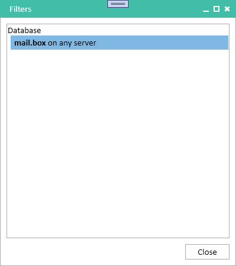

# Filters

Filters allow you to hide databases and users from the UI based on a range of criteria. Teamstudio Usage will continue to collect catalog and usage data for any filtered databases and users, so you can add and remove filters at any time with no loss of data.

Databases and users that have been hidden through filtering will not be displayed in any lists and will be excluded from **all** usage calculations. For example, the last access date for a user in the Usage module is actually the last date that the user accessed a non-filtered database. A user that only accesses filtered databases will not be displayed at all in the UI, in the same way that a user with no access would not be displayed.

## Managing Filters
Filters are created from the *Catalog* view by right-clicking on the database or user that you want to filter. See [Catalog](catalog.md#filters) for details. Filters cannot be modified, but they can be removed. To remove a filter, select *Filters* from the *Window* menu.

<figure markdown="1">

</figure>

This will display a list of all of the filters currently in effect. To remove a filter, right-click on it and select *Remove Filter* from the popup menu.

!!! note
    Usage data needs to be recomputed when filters are added or removed. See [Usage](usage.md#performance) for more details. If you will be adding or removing several filters, it is more efficient to make all of your changes before recomputing usage data.