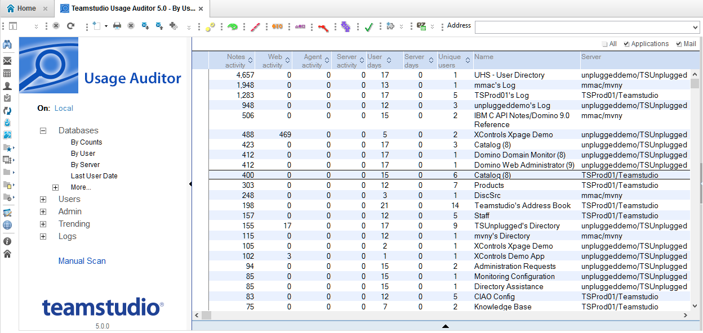

# Introduction

This is the Documentation for the Teamstudio Usage Auditor, version 5.0.
<figure markdown="1">
  
</figure>

## About Teamstudio Usage Auditor
Usage Auditor allows you to track user activity of Notes applications, providing insight into usage trends that will help you make better decisions about your databases and your IT environment.

Auditing your Notes applications will:

* Save time: only update the apps you have to
* Help you know your environment, especially if you inherited it
* Save money: fewer servers means less electricity
