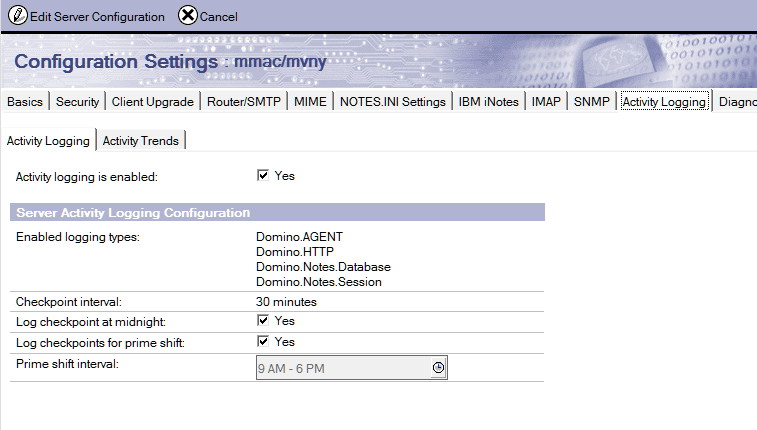

# Installing Usage Auditor

Teamstudio Usage Auditor consists of a Lotus Notes Application (TSUsage.ntf) that manages scanning and aggregation of usage data and generates reports, and a supporting executable application that collects the raw Activity Logging data from servers.

Usage Auditor is designed to be run on a workstation. Usage scanning and reporting are resource intensive processes; running scans from a separate workstation and Notes client limits the impact of Usage Auditor on server performance.

## System Requirements 
Usage Auditor is supported on all all IBM-supported 32-bit configurations of Notes on running on Windows.

Usage Auditor does not currently support 64-bit Domino installations; it is recommended that Usage Auditor be run on a client workstation. 
 
## Prerequisites
Teamstudio Usage Auditor aggregates and reports on data collected by the IBM Domino server’s Activity Logging task.

In order to use Usage Auditor, Activity Logging must be enabled on all servers you wish to include.

Activity Logging can be enabled on the Server Configuration document in the Domino Directory database. Usage Auditor tracks the following activity streams:

* Domino.Notes.Database
* Domino.Notes.Session
* Domino.AGENT
* Domino.HTTP
<figure markdown="1">
  
</figure>

By default, Activity is logged to the Log.nsf database on the server, and the default 2 week retention period for Log.nsf applies to activity as well. Usage Auditor should be run regularly to ensure that there are no gaps in activity collection; once activity is recorded in Usage Auditor, Usage Auditor will maintain summary information for all activity since reporting began.

If you have already enabled Activity Logging for the activity streams above, you can run Usage Auditor immediately, once configured, to report on the currently available activity in the Log.nsf.
 
## Installing the Usage Auditor application
The main Usage Auditor application is a Notes application based on the template TSUsage.ntf.

This application is intended to run scans from a client Workstation. Scanning for and reporting on activity is a resource intensive activity that may access multiple servers and works with file system files as part of the process.

The application can be replicated to servers to make the resulting reports available to a wider audience.

To install the Usage Auditor Notes application, create a new database based on the TSUsage.ntf template on the desired workstations local Data directory.

The application must be signed with an ID that has a least Reader access to the Log.nsf files on the servers to be scanned. If the servers exist in multiple domains, the ID and local workstation must be properly cross-certified to all servers.
 
## Installing the executable
Usage Auditor uses an executable utility, logscan.exe, to collect raw activity data from Domino servers.

If a scan is initiated and this utility is not yet installed in the Notes program directory, Usage Auditor will automatically install it, assuming the current user has appropriate OS rights to allow the install.

In the event that Administrator access is necessary to save this executable to the Notes program directory, the utility is located in the database’s Help > About document, and can be manually detached and saved to the Notes executable directory if needed.

Once saved, the user account running Usage Auditor in Notes must have read and execute rights in order to run the executable.
 
## Upgrading from prior versions of Usage Auditor
To upgrade Usage Auditor, sign the Usage Auditor template, and refresh the design of the target Usage Auditor template.

!!! Note
    Usage Auditor 5.0.0 requires an updated software license key. Contact Teamstudio Support at [teamstudio.com](https://www.teamstudio.com/support) or by email at [techsupport@teamstudio.com](mailto:techsupport@teamstudio.com) to obtain a new key.
    
When upgrading from previous versions, logscan.exe is not automatically upgraded. Upgrade logscan.exe by manually detaching it from the Help > About page to the Notes executable directory. Or simply delete logscan.exe from the Notes executable directory and allow Usage Auditor to reinstall it when a scan is run.

Beginning with Usage Auditor version 5.0.0, user activity is also tracked via individual user documents. User activity tracking at the database level can be disabled via these documents. Users excluded from tracking in previous versions via the "Show non-users for server..." button in the configuration settings are not automatically upgraded.

For more information and assistance upgrading a prior version of Usage Auditor, contact Teamstudio Support at [teamstudio.com](https://www.teamstudio.com/support) or by email at [techsupport@teamstudio.com](mailto:techsupport@teamstudio.com).
 