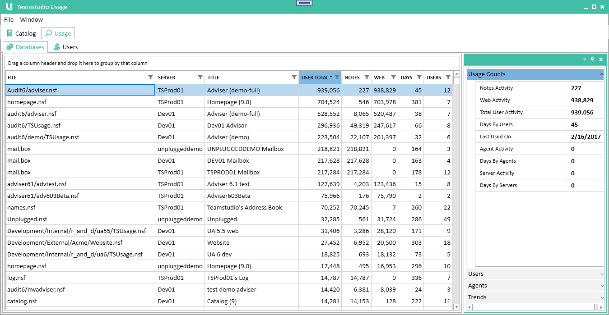
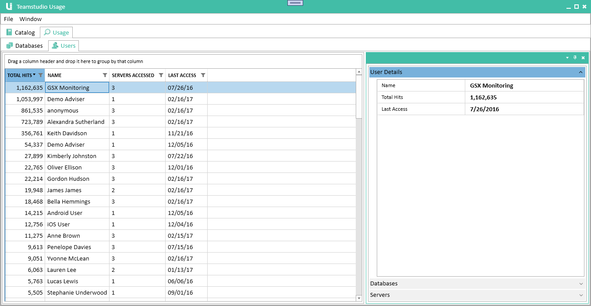

# Usage
The Usage module collects detailed usage information stored in the Domino log file. It allows you to view information about how much your databases are being used and who is using them. It distinguishes between web and client usage and also separates usage by individual users from usage by agents or servers.

## Running Server Scans

The Domino server only retains usage information for fourteen days so it is important that you run server scans regularly to import the data before it is lost. The installation section explains how to configure Teamstudio Usage to run a scan every night.

## Viewing Usage
To view usage data, select the second tab in the Usage window, titled *Usage*.

## Viewing Databases
With the *Usage* tab selected, select the *Databases* tab from the second tab row. This will display the usage database view.

<figure markdown="1">

</figure>

As with the Catalog, this view is split into two parts. On the left is a table showing all databases in the catalog, even those with no usage, sorted in decreasing order of total usage. Please see the [Catalog](catalog.md) page for details on how to sort and search this list. On the right is a details pane giving detailed usage information for the selected database.

### Filters
Databases that have been excluded through filtering will not appear in the list. Also, all of the counts exclude usage by users that have been hidden through filtering.

### Table Columns
|Column|Description|
|---|---|
|*User Total*|The total usage by users i.e., excluding usage by servers and agents. This is the sum of the *Notes* and *Web* columns.|
|*Notes*|The number of database sessions from Notes clients. A session consists of a user opening the database, interacting with it and then closing it again. The session count does not indicate how much work was performed during the session. Each session increases the count by one whether it accessed a single document or hundreds of documents.|
|*Web*|The number of times the database was accessed by users via HTTP. Since HTTP does not have a concept of sessions, this is a count of individual database accesses. For example, opening a page to view a single document might involve several database accesses to retrieve graphics stored as image resources in the database. Therefore the counts in this column tend to be significantly larger than the counts in the *Notes* column.|
|*Days*|The number of unique days on which the database was accessed by at least one user. Again, server and agent hits are excluded.|
|*Users*|The number of unique users that accessed the database|

### Usage Counts
The first section of the details pane shows the same counts that are in the main table, along with separate counts for agent and server usage.

### Users
The second section of the details pane shows the breakdown of the *Notes* and *Web* user usage by user. It also shows the last date on which each user accessed the database.

### Agents
Similar to the *Users* section, this section shows which agents have accessed database, along with a usage count for each.

### Trends
This last section shows a graph of monthly user usage from Notes clients over time. 

## Viewing Users
With the *Usage* tab selected, select the *Users* tab from the second tab row. This will display the usage database view.

<figure markdown="1">

</figure>

This gives the usual two pane view, with a list of users and a details pane for the selected user. The user list is sorted in descending order of total usage by default. Unlike the database view, the list only includes users that have accessed at least one database.

### Table Columns
|Column|Description|
|---|---|
|*Total Hits*|The total number of database accesses recorded for this user. See the database section above for details on how these this count is computed.
|*Servers Accessed*|The number of different servers accessed by this user.
|*Last Access*|The last day on which activity was found for this user.|

### User Details
The first section of the details pane shows the same counts that are in the main table.

### Databases
The second section of the details pane shows the breakdown of the user's usage by database. It also includes the last date on which each user accessed the database.

### Servers
The third section of the details pane shows the breakdown of the user's usage by server.

## Performance
Usage data needs to be recomputed when the application is first launched and whenever filters change. When a database filter is added or removed, the *user* usage needs to be recomputed, and similarly when a user filter is added or removed, the *database* usage needs to be recomputed. Since this can take a little while, Teamstudio Usage does not automatically recompute the data. Instead, you will see a message at the top of the list alerting you that usage may have changed. The message has a link you can click to recompute the data.

If the computation takes more than a few seconds, you will see a busy indicator. You can continue to work with the rest of application, and the indicator will disappear once the computation is complete. It is difficult to give estimates for how long the computation will take since servers vary greatly in size and usage. In our testing, a single server with 1,000 databases, a similar number of users and a year or so of data will be almost instantaneous. A collection of servers with about 10,000 total databases, 20,000 users and 4 years of usage data takes around 30 seconds. 