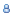
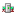
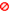
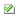
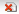
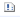

# User Usage Statistics

Usage Statistics at the user level are tracked on a per-server basis:
<figure markdown="1">
  
</figure>

User statistic documents can be found in the views under User in the left-hand navigator. User level statistics are separate from the **By User** views for Databases, which contain Database documents grouped by the user based on the list of users contained in the Database document.

Usage is tracked for Notes client,  HTTP / Web access, and as an Agent signer, along with the last date the user accessed a given server.

## Enabling or Disabling User Tracking
Tracking of usage statistics at the individual server level can be configured on the User document.
 
To prevent statistics being tracked for databases on one or more servers, click **Disable DB Tracking** and choose the server(s) to disable.

To enable tracking on servers previously disabled, click **Enable DB Tracking** and select the server(s) to re-enable.

Tracking can also be automatically disabled for a user when they access a server not previously accessed, by checking **Disable tracking when new servers are accessed**.

!!! note
    The collection of server-level activity counts displayed in the user document will also be disabled for servers where tracking is disabled.
 
## Enabling or Disabling User Tracking in Views 
At the view level, User Tracking can be enabled/disabled for all selected users via the **Database Activity Tracking** action.

This action will enable or disable tracking on all servers.

## View Icons
The first column in User views displays an icon indicating whether the user type is known:

*   indicates that the name represents a user, based on a user document found in the Domino Directory
*   indicates that the name represents a server, based on a server document found in the Domino Directory
*   indicates that the name was not explicitly listed in the Domino Directory - this often occurs when users from another domain are granted access to a server via group or server security document, without being explicitly defined in the current server's domain

The 'tracked' column in User views indicates whether User Tracking is enabled or disabled:

*   indicates the user is tracked for all servers 
*   indicates the user is not tracked on any server
*   indicates that the user is tracked on a subset of servers