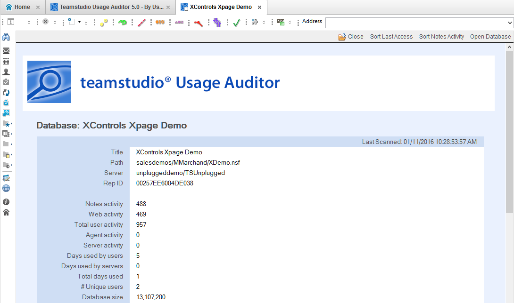
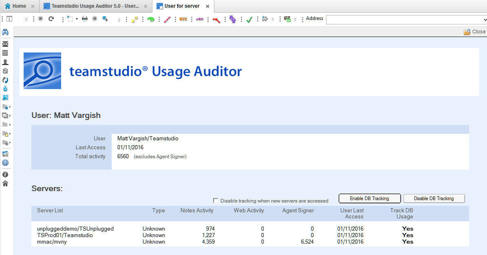

# 紹介

Teamstudio Usage Auditor が起動すると、利用状況の各種情報はデータベースレベルとユーザーレベルで確認できます
 
## データベース統計
Usage Auditor では、データベースレベルでのアクティビティの概要を提供しています。

データベース統計では、Domino アプリケーションへのユーザー、エージェント、サーバーからのアクセスに関する情報があります。この情報にはデータベースレベルでの総アクティビティと最終アクセスに関する情報、個々のアクセスユーザー、エージェントによるアクセス、最終更新時刻などをサマリーしています。 
<figure markdown="1">
  
</figure> 

 
ユーザー情報には Notes クライアントからのアクティビティと HTTP/Webブラウザーからのアクティビティの両方の情報を提供しています。

データベース利用状況のレポートの詳細は [データベース利用状況の統計](database.md) を参照してください。

どのようにカウントを計算するかについての詳細は [サーバーのスキャン](scanning.md) を参照してください。
 
## ユーザー統計
Usage Auditor では、ユーザーレベルでのアクティビティの概要を提供しています。

ユーザーレベルのサマリー統計では、それぞれのサーバー上でのユーザーのアクティビティの総計についての情報を提供しています。Notes クライアント、HTTP/Webブラウザー、エージェントの署名者としてのユーザーのアクティビティに関する情報があり、最終ユーザー明日セスの最新日付時刻も提供しています。 
<figure markdown="1">
  
</figure>

利用状況統計の追跡はは個々のサーバー、サーバーすべての単位で有効／無効化できます。

ユーザーの利用状況のレポートに関する詳細は [ユーザー利用状況の統計](user.md) を参照してください。
